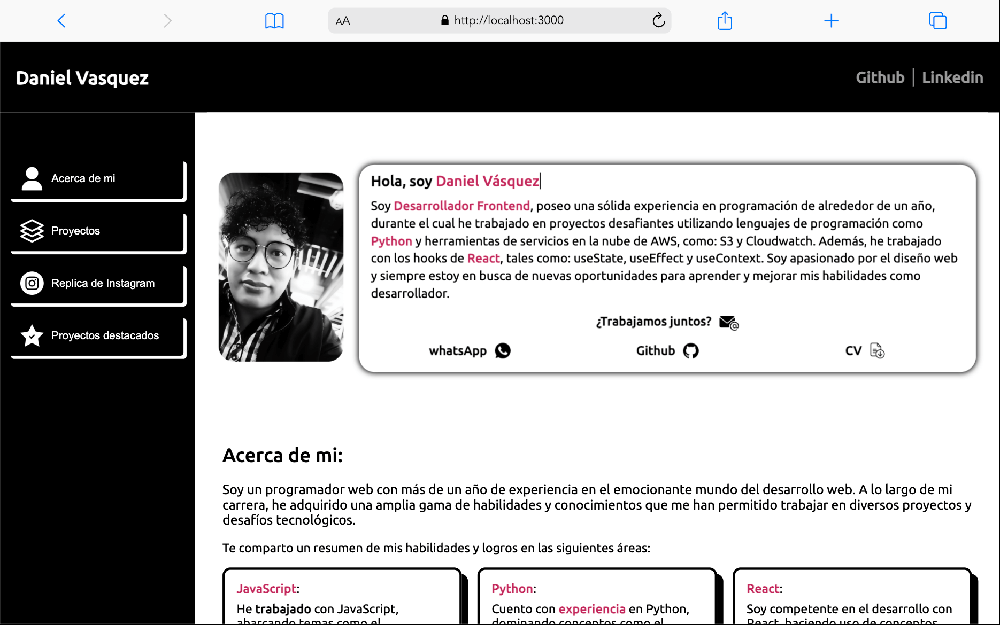
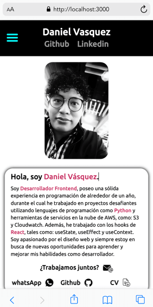

# Portafolio Web Daniel Vásquez

**Versión Desktop:**

**Versión Mobile:**

¡Bienvenido a mi portafolio web! Este sitio web es una presentación de mis habilidades, proyectos y experiencias en el mundo del desarrollo web.

## Acerca de mí

Soy un desarrollador web apasionado por la creación de aplicaciones web y la resolución de problemas mediante la programación. Aquí hay algunas cosas sobre mí:

- **Nombre:** Daniel Vásquez
- **Ubicación:** Ciudad de México
- **Sitio web:** https://portfolio-daniel-vasquez.vercel.app/

## Tecnologías y Habilidades

En mi viaje como desarrollador, he adquirido experiencia en diversas tecnologías y habilidades, que incluyen:

- HTML5
- CSS3 
- JavaScript
- React.js
- Node.js, 
- Express.js
- Control de versiones con Git
- Python
- AWS (S3, cloudwatch)
- Node.js
- Express

## Experiencia

- **Atoms** - Abril 2022 a Noviembre 2022
  - Desarrollador web.

- **Neximo** - Noviembre 2022 a Abril 2022
  - Becario en investigación y automatización de procesos

## Contacto

¡Me encantaría conectar contigo! Puedes encontrarme en las siguientes plataformas:

- [Correo Electrónico](dani.vasquez.dev@gmail.com)
- [LinkedIn](https://www.linkedin.com/in/daniel-vasquez-nepomuceno/)
- [GitHub](https://github.com/Daniel-Vasquez)

No dudes en contactarme si tienes alguna pregunta, sugerencia o oportunidad de colaboración.

¡Gracias por visitar mi portafolio!
